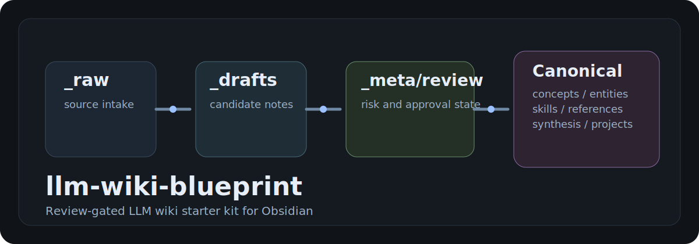

# llm-wiki-blueprint

[English](./README.md) | [简体中文](./README.zh-CN.md)

面向 Obsidian 的 **带审稿闸门的 LLM Wiki 开源 starter kit**。



它适合构建这样的私有或团队知识库：

- 新资料先进入原始入口
- AI 先生成 draft，而不是直接写入正式知识区
- 通过 review 后再发布
- 低信号内容可以先隔离
- 整个系统继续兼容智能体驱动的执行方式

## 为什么要做这个项目

很多 LLM 知识库工作流最后会失败，通常是因为：

- 太手工，难以长期坚持
- 太自动，结果不值得信任

这个项目选择中间路线：

**AI 负责整理与编译，人负责最终发布判断。**

## 你能得到什么

- 一套推荐的 Obsidian Vault 结构
- 原始资料、draft、正式知识、review、隔离区的模板
- 路由、审稿、生命周期、隔离区的治理文档
- 一套示例 Obsidian 配置
- 中英文文档
- 增强层样板
- 一套从 raw 到 reviewed canonical 的最小示例内容

## 核心工作流

```text
_raw -> _drafts -> _meta/review -> 正式知识区
```

正式知识区建议目录：

- `concepts/`
- `entities/`
- `skills/`
- `references/`
- `synthesis/`
- `projects/`

## 快速开始

### 方式 A：手动部署

1. 创建一个新的私有 Vault 目录
2. 把本仓库的蓝图结构复制进去
3. 用 Obsidian 打开该 Vault
4. 让你偏好的执行型智能体指向这个 Vault
5. 从 `_raw/` 开始使用

### 方式 B：智能体引导部署

也可以用 Claude Code、Codex 或其他具备文件能力的智能体，直接把这套蓝图部署到新的 Vault。

入口文档：

- [快速开始](./docs/quickstart.md)
- [部署方式](./docs/deployment.zh-CN.md)

## 开始阅读

- [Home](./Home.md)
- [文档总索引](./docs/README.md)
- [快速开始](./docs/quickstart.md)
- [使用说明](./docs/usage.md)
- [架构图](./docs/architecture-diagrams.md)
- [中文导览](./docs/chinese-guide.md)

## 生态位置

这套 starter kit 假定你有一个三层生态：

1. **基座工作流仓库**
   单独存在，负责 skills、workflow、agent 接入

2. **私有 live Vault**
   存放 raw、draft、review state 和正式知识

3. **增强层**
   用于放 wrappers、review-flow、管理插件或其他外围增强能力

本仓库负责的是：

**Vault 蓝图层。**

相关说明：

- [生态说明](./docs/ecosystem.md)
- [参考项目](./docs/reference-projects.md)

## 兼容矩阵

| 层 | 含义 | 是否必需 | 说明 |
|---|---|---|---|
| 基座工作流仓库 | 外部 workflow / skills / bootstrap 层 | 推荐 | 建议保持独立，方便继续跟上游 |
| Live Vault | 你的私有 Obsidian 知识库 | 必需 | 本 starter kit 是给这一层复制和改造用的 |
| 执行型智能体 | Claude Code、Codex 或类似具备文件能力的智能体 | 必需 | 负责 ingest、draft、重做和归档 |
| 增强层 | 外部 wrappers / review-flow / UI 实验层 | 可选 | 适合放变化快、不想污染基座的逻辑 |
| Obsidian 插件栈 | Dataview、Templater、Linter、Git、BRAT | 推荐 | 提高可视化、模板一致性和扩展能力 |
| 未来管理插件 | 可选的可视化控制层 | 可选 | 可以叠加在 live Vault 上，但不替代现有工作流 |

## 推荐插件栈

这套 starter kit 推荐搭配：

- Dataview
- Templater
- Linter
- Git
- BRAT

后续还可以叠加执行型智能体插件或管理面板插件。

## 文档入口

核心文档：

- [文档总索引](./docs/README.md)
- [快速开始](./docs/quickstart.md)
- [使用说明](./docs/usage.md)
- [部署方式](./docs/deployment.zh-CN.md)
- [架构图](./docs/architecture-diagrams.md)
- [中文导览](./docs/chinese-guide.md)

项目规范：

- [贡献说明](./CONTRIBUTING.md)
- [更新日志](./CHANGELOG.md)
- [安全说明](./SECURITY.md)
- [许可证](./LICENSE)

## 示例与 starter 资产

- [examples/wiki_ext](./examples/wiki_ext)
- [examples/sample-content](./examples/sample-content)
- [scripts/bootstrap-sample-vault.ps1](./scripts/bootstrap-sample-vault.ps1)
- [scripts/bootstrap-sample-vault.sh](./scripts/bootstrap-sample-vault.sh)

## 这个项目不是什么

它不是：

- 某个执行型智能体的替代品
- 某个厂商专属方案
- 图数据库
- 自动无人值守发布系统
- 公共 live 知识库

## 使用原则

把这个仓库当成：

- 框架层
- starter kit
- 模板层

而不是把它直接当成你的私有 live 知识库。
