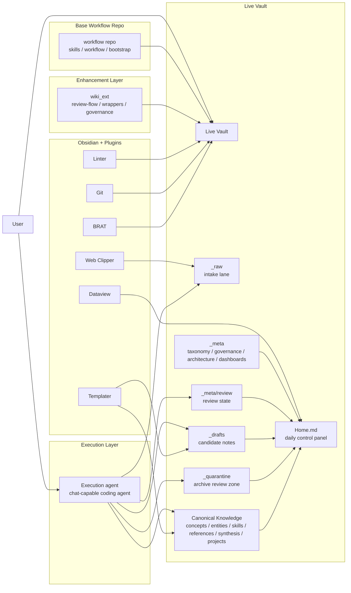
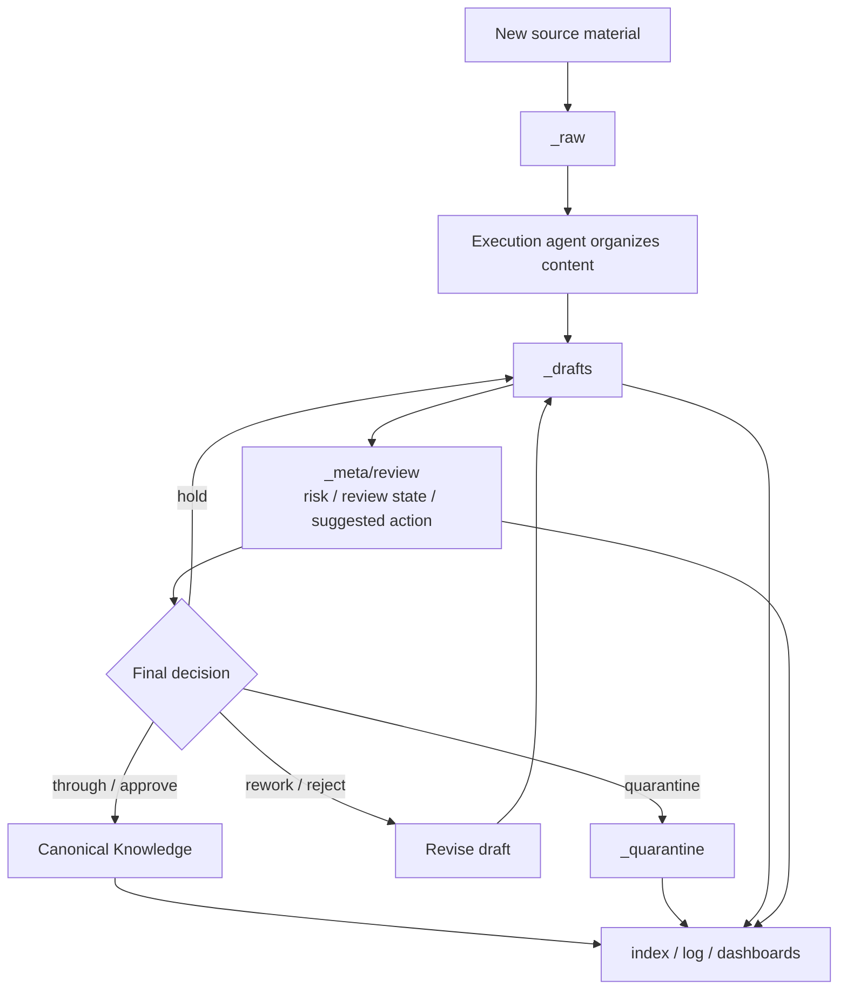
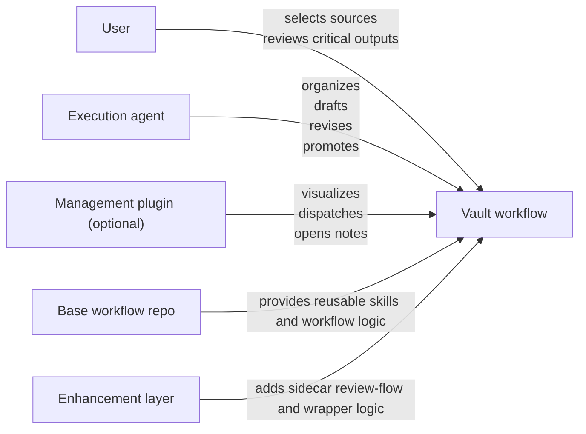

# Architecture Diagrams

This document provides visual architecture diagrams for the current llm-wiki ecosystem.

These diagrams are intended to explain:

- the system layers
- the role of the base workflow repo
- the role of the live private vault
- the role of the enhancement layer
- the role of the execution agent
- the content movement from raw material to canonical knowledge

## 1. System Architecture

## 2. Content Workflow

## 3. Responsibility Split

## 4. Design Reading Notes

### Base workflow repo

Provides:

- reusable workflow logic
- skills
- bootstrap patterns

It should remain as clean and updatable as possible.

### Live vault

Stores:

- raw material
- drafts
- review state
- canonical knowledge
- governance and architecture docs

This is the real data layer.

### Enhancement layer

Stores:

- extra review-flow notes
- wrappers
- sidecar governance
- experimentation that should not pollute the base workflow repo

### Execution layer

Performs:

- ingest
- draft generation
- draft revision
- promotion after approval

### Optional plugin layer

Provides:

- visual queue management
- button-driven task dispatch
- direct note opening
- workflow visibility

It should not replace the vault as the source of truth.

